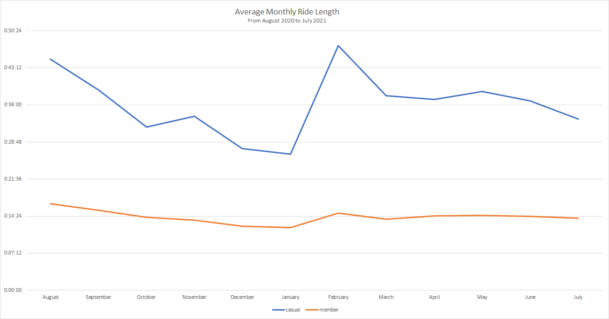
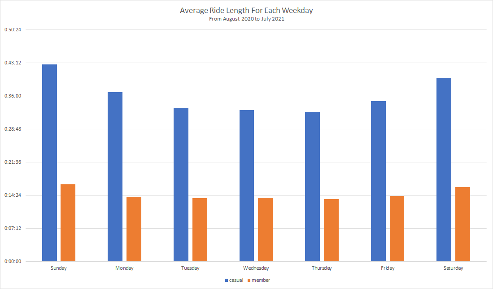
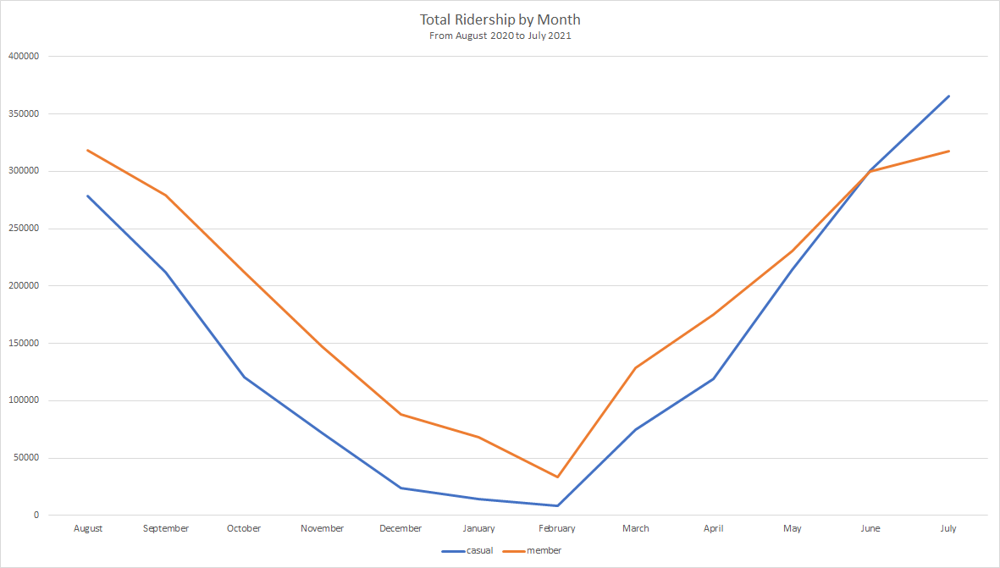
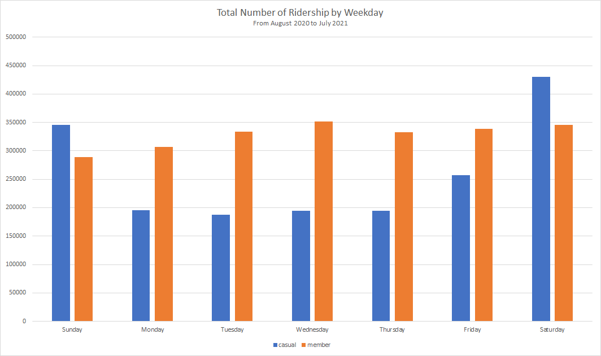

# Cyclistic

This is my capstone project for the Google Data Analytics certificate from Coursera.

## Background

Cyclistic is a ficticious company looking for ways to grow its business.  The Director of Marketing, Lily Moreno, believes the company's future depends on maximizing the number of annual memberships.  Cyclistic has a bike-share program that features more than 5,800 bicycles and over 600 docking stations.  Cyclistic sets itself apart by also offering reclining bikes, hand tricycles, and cargo bikes, making bike-sharing more inclusive to people with disabilities and riders who can't use a standard two-wheeled bike.  A majority of bike riders opt for traditional two-wheel bicycle, while about 8% of riders use assistive options.  Most of our users ride bikes for leisure, with about 30% using bikes to commute to work each day.

Cyclistic bikes can be unlocked from one station and returned to station in the system anytime.  Until now, Cyclistic's marketing strategy relied on building general awareness and appealing to broad consumer segments.  Unlocking the bikes involves offering single-ride passes, full-day passes, and annual memberships.  Customers who purchase single-ride or full-day passes are referred to as casual riders.  Customers who purchase annual memberships are Cyclistic members.

Cyclistic's finance analysts determined that annual members are much more profitable than casual riders.  Although our current pricing flexibility helps Cyclistic attract more customers, Moreno believes that maximizing the number of annual members is the key to future growth.  Rather than creating a marketing campaign that targets all-new customers, Moreno believes there is a very good chance to convert existing casual riders into members.  Casual riders are already familiar with the Cyclistic program and have chosen Cyclistic for their mobility needs.

I have been tasked with understanding how casual riders and annual members use Cyclistic bikes differently.  From these insights, my team will design a new marketing strategy to convert casual riders into annual members.

## Data Source

Although Cyclistic is a ficticious company, I will be using real-world data to do my analysis.  The data used in this project was downloaded from the [Divvy Trip Data](https://www.divvybikes.com/system-data).  [Divvy](https://www.divvybikes.com) is the city of Chicago's bike share program.  From now on, we will use Divvy and Cyclistic interchangably.  Again, keep in mind that Cyclistic is a fictional company and we are using Divvy's data as if it came from Cyclistic.

The Cyclistic bike sharing data is based on [General Bikeshare Feed Specification (GBFS)](https://github.com/NABSA/gbfs).  The GBFS is an open data standard that makes real-time data feeds in a uniform format publically available online, with an emphasis on findability.  The data is collected from sensor data from the bike docking stations and is complete without data loss.

### Data Fields (Data Dictionary)

* ride_id -- unique identifer of a particular bike trip
* rideable_type -- type of bike used (classic pedal, pedal assist bikes aka e-bikes)
* started_at -- date and time the bike trip was removed from a dock
* ended_at -- date and time the bike trip was returned to a dock
* start_station_name -- location of the starting docking station
* start_station_id -- alphanumeric identifier of the starting dock
* end_station_name -- location of the ending docking station
* end_station_id -- alphanumeric identifier of the ending dock
* start_lat -- latitude of the starting docking station
* start_lng -- longitude of the starting docking station
* end_lat -- latitude of the ending docking station
* end_lng -- longitude of the ending docking station
* member_casual -- type of rider (casual rider or member)

More information about the data set can be found at:  [City of Chicago Data Portal for Divvy Trips](https://data.cityofchicago.org/Transportation/Divvy-Trips/fg6s-gzvg).  Information regarding systematic changes to the dataset can also be found at:  [City of Chicago Open Data Portal](http://dev.cityofchicago.org/open%20data/data%20portal/2019/12/17/divvy-datasets-revived.html).

[List of current bike stations.](https://data.cityofchicago.org/Transportation/Divvy-Bicycle-Stations/bbyy-e7gq)

### Importing Data

Data is downloaded at [Divvy Trip Data](https://divvy-tripdata.s3.amazonaws.com/index.html).  To get a good idea of rider trends, we will be analyzing monthly trip data over a 12 month period (August 2020 through July 2021).  The data set is published as a comma-separated value (CSV) text file.  We import these CSV files to tables housed in a Microsoft SQL Server database.  The SQL tables are then cleaned and then copied to a larger table.  Data visualizations are created by running a SQL query, exporting the result table to an Excel spreadsheet, and creating a chart in Excel.

## Data Cleaning Process

The following steps are repeated for each monthly table.

### Add Ride Length Field

It may help to know the average time casual and member riders use per weekday or month.  May give some insights in how our riders utilize bikes.  We need to add a field called "ride_length_sec" and store this value for each recorded trip.

    ALTER TABLE dbo.[divvy.tripdata.202008]
        ADD ride_length_sec [int] NULL;

Once the field has been added to the structure of our table, we run the following SQL statement to populate the ride_length_sec field:

    UPDATE dbo.[divvy.tripdata.202008]
        SET ride_length_sec = DATEDIFF(SS, started_at, ended_at);

This statement calculates the number of seconds between the start and end times of a particular trip.

### Add Day of the Week Field

It may be helpful to know how our users utilize our bikes by day of the week.  We need to add a field called "day_of_week_text" and store this value for each recorded trip.

    ALTER TABLE dbo.[divvy.tripdata.202008]
        ADD day_of_week NVARCHAR(10) NULL;

Once the field has been added to the structure of the database, we run the following SQL statement to populate the day_of_week_text:

    UPDATE dbo.[divvy.tripdata.202008]
        SET day_of_week_text = DATENAME(WEEKDAY, started_at);

### Start Time > End Time

Remove recorded bike trips where the start time occurs later than the end time.  There were a few instances where this occurs.  Obviously, the start time cannot occur later than the end time therefore, this data is erroneous and should be removed from our analysis.

    DELETE FROM dbo.[divvy.tripdata.202008]
        WHERE started_at > ended_at;

### Ride Lengths Less than a Minute

According to [Divvy Trip Data](https://www.divvybikes.com/system-data), we should remove any ride lengths less than a minute due to possibly false starts or users trying to re-dock a bike to ensure it was secure.

    DELETE FROM dbo.[divvy.tripdata.202008]
        WHERE ride_length_sec < 60;

### Remove Test Fields

There were certain trips that indicated the station ID were test stations.  Let's remove these trips as they will not provide any insights into our analysis.

    DELETE FROM dbo.[divvy.tripdata.202008]
        WHERE start_station_id LIKE '%TEST%' OR end_station_id LIKE '%TEST%';

### Trips with no Coordindates nor Station Identifiers

Remove trips that are missing any coordinates or docking station identifiers

    DELETE FROM dbo.[divvy.tripdata.202008]
        WHERE start_lat IS NULL OR start_lng IS NULL OR end_lat IS NULL OR end_lng IS NULL;
    
    DELETE FROM dbo.[divvy.tripdata.202008]
        WHERE start_station_id IS NULL OR end_station_id IS NULL;

### Combine Tables

Creation of combined table:

    CREATE TABLE dbo.[cyclistic.tripdata](
        [ride_id] [nvarchar](50) NOT NULL,
        [rideable_type] [nvarchar](50) NOT NULL,
        [started_at] [datetime2](7) NOT NULL,
        [ended_at] [datetime2](7) NOT NULL,
        [start_station_name] [nvarchar](60) NOT NULL,
        [start_station_id] [nvarchar](50) NOT NULL,
        [end_station_name] [nvarchar](60) NOT NULL,
        [end_station_id] [nvarchar](50) NOT NULL,
        [start_lat] [float] NOT NULL,
        [start_lng] [float] NOT NULL,
        [end_lat] [float] NOT NULL,
        [end_lng] [float] NOT NULL,
        [member_casual] [nvarchar](50) NOT NULL,
        [ride_length_sec] [int] NOT NULL,
        [day_of_week_text] [nvarchar](10) NOT NULL,
        [month]  AS (DATENAME(month,[started_at])),
        CONSTRAINT PK_cyclistictripdata_rideid PRIMARY KEY (ride_id)
    )

Repeat the above processes for the rest of the monthly trip data tables.  Once that is complete, use the following SQL statement to copy each table to the main table (dbo.[cyclistic.tripdata]).

    INSERT INTO dbo.[cyclistic.tripdata] (
        ride_id,
        rideable_type,
        started_at,
        ended_at,
        start_station_name,
        start_station_id,
        end_station_name,
        end_station_id,
        start_lat,
        start_lng,
        end_lat,
        end_lng,
        member_casual,
        ride_length_sec,
        day_of_week_text
    )
    SELECT
        ride_id,
        rideable_type,
        started_at,
        ended_at,
        start_station_name,
        start_station_id,
        end_station_name,
        end_station_id,
        start_lat,
        start_lng,
        end_lat,
        end_lng,
        member_casual,
        ride_length_sec,
        day_of_week_text
    FROM dbo.[divvy.tripdata.202008];

## Analysis

### Chart #1:  Average Monthly Ride Length

It would be helpful to analyze and visualize the average bike trip length per month.  Below is the SQL used to create the visualization in Excel:

    SELECT * FROM (
        SELECT
            [month],
            member_casual,
            ride_length_sec
        FROM dbo.[cyclistic.tripdata]
    ) AS t
    PIVOT (
        AVG(ride_length_sec)
        FOR [month] IN (
            [August],[September],[October],[November],
            [December],[January],[February],[March],
            [April],[May],[June],[July]
        )
    ) AS pvt_tbl;

As we can see, member riders tend to be steady in their utilization of our bikes.  However, the casual ridership is a lot more erratic.  Overall, casual riders tend to take longer trips than members.

### Chart #2:  Average Ride Length by Weekday

Let's analyze the average bike trip length per weekday from August 2020 through July 2021.  Below is the SQL statement used to create the visualization in Excel:

    SELECT * FROM (
        SELECT
            day_of_week_text,
            member_casual,
            ride_length_sec
        FROM dbo.[cyclistic.tripdata]
    ) AS t
    PIVOT (
        AVG(ride_length_sec)
        FOR day_of_week_text IN (
            [Sunday],[Monday],[Tuesday],[Wednesday],
            [Thursday],[Friday],[Saturday]
        )
    ) AS pvt_tbl;

Just as in the monthly analysis of average ride times, casual riders have a tendency of taking longer trips than our members.  Members take consistent rides throughout the week.

### Chart #3:  Total Monthly Ridership

Below is the analysis of the number of individual bike trips for each month between August 2020 through July 2021.  SQL statement used to generate the visualization:

    SELECT * FROM (
        SELECT
            ride_id,
            [month],
            member_casual
        FROM dbo.[cyclistic.tripdata]
    ) AS t
    PIVOT (
        COUNT(ride_id)
        FOR [month] IN (
            [August],[September],[October],[November],
            [December],[January],[February],[March],
            [April],[May],[June],[July]

    )

In this chart, there is a huge drop in ridership in the winter months.  However, ridership tends to pick up during warmer weather, especially during the summer months.  This may either be due to a drop in temperature in Chicago, or due to COVID-19 restrictions, or a combination of both.

### Chart #4:  Total Ridership by Weekday

Let's see the total number of individual bike ride for each day of the week.  Below is the SQL statement used to generate the chart that follows:

    SELECT * FROM (
        SELECT
            ride_id,
            day_of_week_text
        FROM dbo.[cyclistic.tripdata]
    ) AS t
    PIVOT (
        COUNT(ride_id)
        FOR day_of_week_text IN (
            [Sunday],[Monday],[Tuesday],[Wednesday],
            [Thursday],[Friday],[Saturday]
    )

Again, it seems that our member riders have consistent utilization numbers throughout the week.  Casual riders have a more varied usage.  Fridays, Saturdays, and Sundays seem to be the most popular days among casual riders.

## Recommendations

### Recommendation #1

Based on the number of riders on Friday, Saturday, and Sunday (Chart #4), we can hold special membership drive events on the weekends.  Our analysis shows that casual riders tend to ride on the weekends.  This is a great opportunity to employ marketing campaigns during this weekend to maximize the chance to convert some of our casual riders to members.

Instead of relying on general awareness to gain ridership, we can utilize a social media campaign to convince casual riders to become members.  Perhaps showing casual riders the benefits of becoming a member on social media platforms may convince them to purchase memberships.

### Recommendation #2

Based on our analysis of total ridership by month (Chart #3), all riders (including casual riders) tend to utilize our services during the summer months, especially June and July.  This is also presents a great opportunity to hold membership campaigns to convert casual riders to members.

### Recommendation #3

Based on our analysis of the average length of a single trip by weekday and month (Charts #1 and #2), casual riders have a tendency of taking longer trips than members.  We could offer a rewards or incentives program for members who utilize our bikes.  This may entice casual members to become members.

## Presentation

[PowerPoint Slides](./Cyclistic-Deliverables.pptx)

## Change Log

[Change Log](./Cyclistic-Change-Log.xlsx)
